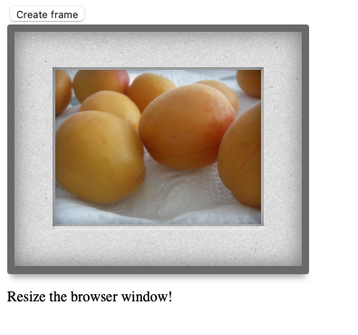

# artframe

I fiddled around trying to style images for a photo preview web page. As the frame needs to change in proportion of the image during a resize, I had to write a JavaScript wrapper to make it work.

The frames have rounded angles, bottom-weighting and a fake bevelled-edge mat.

